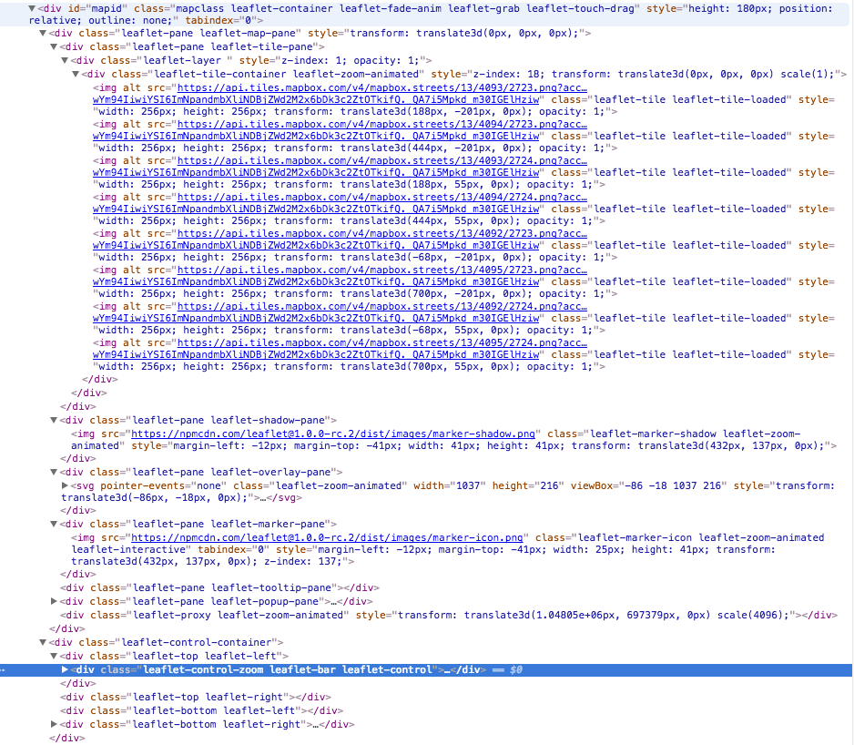

## Why Bother?
In the history of the marking up web pages, maps have often been treated as second class citizens. Even in the introduction of HTML5 we did not receive a semantic <map> element. Instead we have been left to build maps using JavaScript libraries that imperatively change state to update the DOM to give the desired effect. This has always worked, however it has never been particularly clean from a markup perspective. We leave a lot of meaning to be deduced by giving div elements expressive class names, as seen:

  

    
  

The way we create maps in JavaScript actually draws many parallels with how our headers, tables, navigation bars and so fourth. We add pngs, svgs and other elements to a div until we get the desired result (albeit in a slightly more complex form than that). We construct our maps from their rawest building blocks (divs, pngs, svgs), rather than composing them in the language that we talk about them as humans (basemaps, markers, layers etc).

This is where Starch comes in. Riding on a recent history in web development of aiming to have reusable components. We see components in React, Angular, Ember and many other modern JavaScript frameworks. However one prevailing idea is that of a native set of web specifications referred to as '[Web Components](http://www.webcomponents.org)'. Starch uses a popular web components library called [Polymer](http://www.polymer-project.org), which comes from Google.
